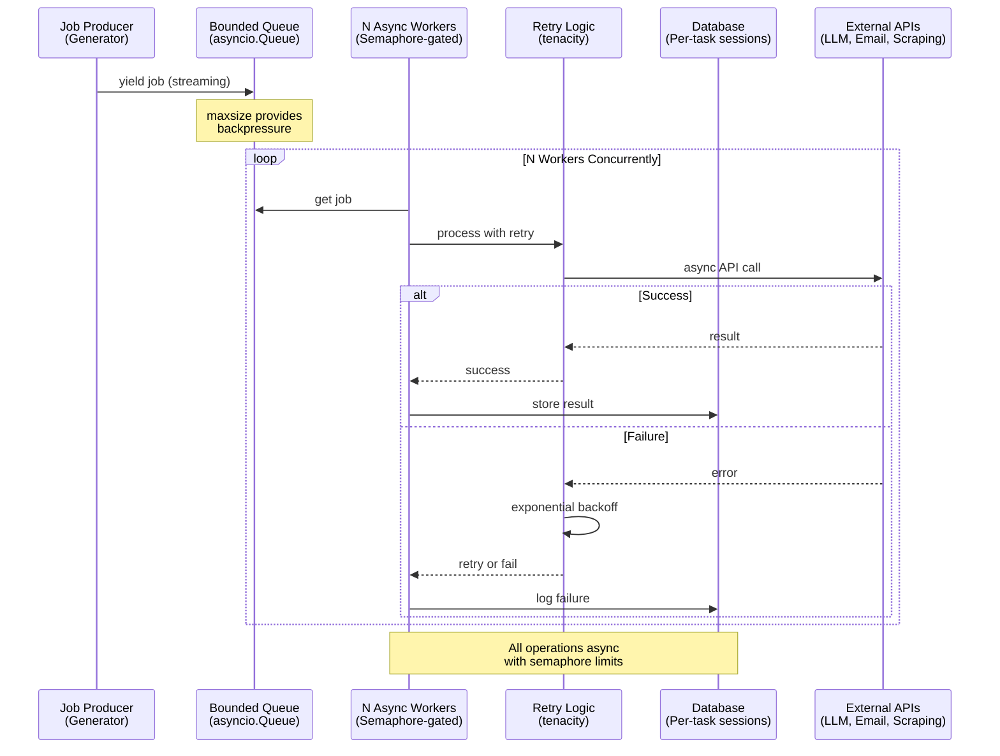
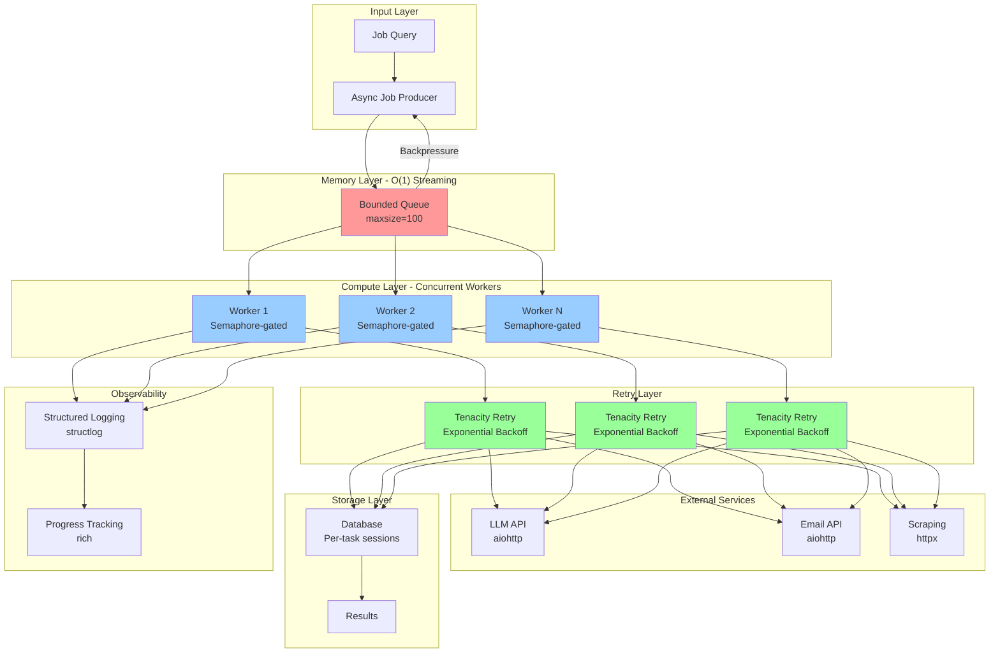
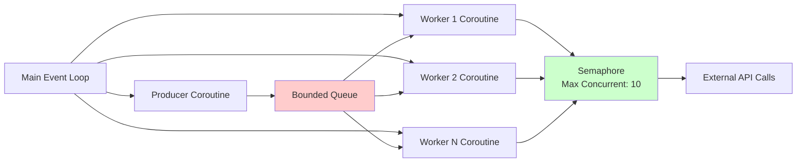

# Design Document: Async Job Pipeline Refactor

## Overview

Transform the existing Python-based job automation pipeline from a partially-async, sequential processing model into a high-performance, fully-async concurrent system.


Transform the existing Python-based job automation pipeline from a partially-async, sequential processing model into a high-performance, fully-async concurrent system. The refactor targets maximum throughput, O(1) memory usage through streaming, and production-grade reliability with automatic retry logic, structured logging, and natural backpressure mechanisms.

Current bottlenecks: sequential job processing, blocking I/O operations, unbounded memory growth, lack of rate limiting, and insufficient error handling. The new architecture implements a producer-consumer pattern with bounded queues, async workers, semaphore-based concurrency control, and streaming generators for memory efficiency.

## Main Algorithm/Workflow



## Core Interfaces/Types

```python
from dataclasses import dataclass
from typing import AsyncGenerator, Callable, Optional, Any, Dict
from enum import Enum
import asyncio

class JobStatus(Enum):
    PENDING = "pending"
    PROCESSING = "processing"
    COMPLETED = "completed"
    FAILED = "failed"
    RETRYING = "retrying"

@dataclass
class JobContext:
    """Immutable job context passed through pipeline"""
    job_id: str
    title: str
    company: str
    description: str
    url: str
    source: str
    metadata: Dict[str, Any]

@dataclass
class ProcessingResult:
    """Result of job processing"""
    job_id: str
    status: JobStatus
    data: Optional[Dict[str, Any]]
    error: Optional[str]
    attempt_count: int
    processing_time_ms: float

class AsyncJobProducer:
    """Streaming job producer with O(1) memory"""
    async def produce_jobs(
        self, 
        query: str, 
        chunk_size: int = 100
    ) -> AsyncGenerator[JobContext, None]:
        """Yields jobs in chunks, never loads all into memory"""
        ...

class AsyncJobWorker:
    """Concurrent worker with retry logic"""
    async def process_job(
        self, 
        job: JobContext, 
        semaphore: asyncio.Semaphore
    ) -> ProcessingResult:
        """Process single job with semaphore-based rate limiting"""
        ...

class BoundedQueue:
    """Async queue with natural backpressure"""
    def __init__(self, maxsize: int):
        self.queue: asyncio.Queue[JobContext] = asyncio.Queue(maxsize=maxsize)
    
    async def put(self, item: JobContext) -> None:
        """Blocks when queue is full (backpressure)"""
        ...
    
    async def get(self) -> JobContext:
        """Blocks when queue is empty"""
        ...
```


## Key Functions with Formal Specifications

### Function 1: async_job_producer()

```python
async def async_job_producer(
    db_session_factory: Callable,
    query: str,
    chunk_size: int = 100,
    offset: int = 0
) -> AsyncGenerator[JobContext, None]:
    """
    Streaming job producer using async generator pattern.
    Yields jobs in chunks to maintain O(1) memory usage.
    """
```

**Preconditions:**
- `db_session_factory` is a valid callable that returns async database sessions
- `chunk_size` is a positive integer (1 ≤ chunk_size ≤ 1000)
- `offset` is a non-negative integer
- Database connection is available and healthy

**Postconditions:**
- Yields JobContext objects one at a time
- Memory usage remains constant regardless of total job count
- Database sessions are properly closed after each chunk
- Generator completes when no more jobs are available
- No jobs are skipped or duplicated

**Loop Invariants:**
- Current offset always points to next unprocessed job
- All yielded jobs have unique job_ids
- Database session is closed before yielding next chunk

### Function 2: async_worker_pool()

```python
async def async_worker_pool(
    queue: asyncio.Queue,
    worker_count: int,
    processor: Callable,
    semaphore: asyncio.Semaphore
) -> List[ProcessingResult]:
    """
    Spawns N concurrent workers that drain the job queue.
    Each worker respects semaphore limits for rate control.
    """
```

**Preconditions:**
- `queue` is a valid asyncio.Queue instance
- `worker_count` is a positive integer (1 ≤ worker_count ≤ 100)
- `processor` is an async callable that processes JobContext
- `semaphore` has a positive value (concurrent operation limit)

**Postconditions:**
- All jobs in queue are processed exactly once
- Returns list of ProcessingResult for all jobs
- All workers terminate gracefully when queue is empty
- No jobs are lost or processed multiple times
- Semaphore is properly released after each operation

**Loop Invariants:**
- Number of active workers ≤ worker_count
- Number of concurrent operations ≤ semaphore value
- Queue size decreases monotonically
- All acquired semaphores are released

### Function 3: retry_with_backoff()

```python
async def retry_with_backoff(
    operation: Callable,
    max_retries: int = 3,
    base_delay: float = 1.0,
    max_delay: float = 60.0,
    exponential_base: float = 2.0
) -> Any:
    """
    Executes async operation with exponential backoff retry logic.
    Delay formula: min(base_delay * (exponential_base ** attempt), max_delay)
    """
```

**Preconditions:**
- `operation` is an async callable
- `max_retries` ≥ 0
- `base_delay` > 0
- `max_delay` ≥ base_delay
- `exponential_base` > 1.0

**Postconditions:**
- Returns operation result if successful within max_retries attempts
- Raises last exception if all retries exhausted
- Total delay ≤ sum of geometric series: base_delay * (exponential_base^(max_retries+1) - 1) / (exponential_base - 1)
- Each retry delay is capped at max_delay

**Loop Invariants:**
- Current attempt ≤ max_retries
- Delay between attempts increases exponentially
- Previous exceptions are logged before retry


## Algorithmic Pseudocode

### Main Processing Algorithm

```pascal
ALGORITHM processJobPipeline(query, worker_count, queue_size)
INPUT: query (search query string), worker_count (number of concurrent workers), queue_size (bounded queue capacity)
OUTPUT: results (list of ProcessingResult objects)

BEGIN
  // Initialize components
  queue ← BoundedQueue(maxsize=queue_size)
  semaphore ← Semaphore(value=worker_count)
  results ← empty list
  
  // Start producer task (runs concurrently)
  producer_task ← ASYNC_TASK(produceJobs(query, queue))
  
  // Start worker tasks (N concurrent workers)
  worker_tasks ← empty list
  FOR i FROM 1 TO worker_count DO
    task ← ASYNC_TASK(workerLoop(queue, semaphore, results))
    worker_tasks.append(task)
  END FOR
  
  // Wait for producer to finish
  AWAIT producer_task
  
  // Signal workers to stop (poison pills)
  FOR i FROM 1 TO worker_count DO
    AWAIT queue.put(NULL)
  END FOR
  
  // Wait for all workers to complete
  AWAIT ALL worker_tasks
  
  RETURN results
END

ALGORITHM produceJobs(query, queue)
INPUT: query (search query), queue (bounded async queue)
OUTPUT: None (side effect: fills queue with jobs)

BEGIN
  offset ← 0
  chunk_size ← 100
  
  LOOP
    // Fetch chunk from database (async)
    chunk ← AWAIT fetchJobChunk(query, offset, chunk_size)
    
    IF chunk IS EMPTY THEN
      BREAK  // No more jobs
    END IF
    
    // Put each job in queue (blocks if queue is full - backpressure)
    FOR EACH job IN chunk DO
      AWAIT queue.put(job)
    END FOR
    
    offset ← offset + chunk_size
  END LOOP
  
  // Producer finished
END

ALGORITHM workerLoop(queue, semaphore, results)
INPUT: queue (job queue), semaphore (concurrency limiter), results (shared result list)
OUTPUT: None (side effect: processes jobs and appends to results)

BEGIN
  LOOP
    // Get next job (blocks if queue is empty)
    job ← AWAIT queue.get()
    
    IF job IS NULL THEN
      BREAK  // Poison pill received, worker stops
    END IF
    
    // Acquire semaphore (blocks if limit reached)
    AWAIT semaphore.acquire()
    
    TRY
      // Process job with retry logic
      result ← AWAIT processJobWithRetry(job)
      results.append(result)
    FINALLY
      // Always release semaphore
      semaphore.release()
    END TRY
  END LOOP
END

ALGORITHM processJobWithRetry(job)
INPUT: job (JobContext object)
OUTPUT: result (ProcessingResult object)

BEGIN
  max_retries ← 3
  base_delay ← 1.0
  attempt ← 0
  
  LOOP WHILE attempt < max_retries
    TRY
      // Attempt processing
      start_time ← current_time()
      
      // Extract skills (async LLM call)
      skills ← AWAIT extractSkills(job.description)
      
      // Match resume (async LLM call)
      match_result ← AWAIT matchResume(skills, job)
      
      // Store in database (async)
      AWAIT storeResult(job, match_result)
      
      processing_time ← current_time() - start_time
      
      RETURN ProcessingResult(
        job_id=job.job_id,
        status=COMPLETED,
        data=match_result,
        error=NULL,
        attempt_count=attempt + 1,
        processing_time_ms=processing_time
      )
      
    CATCH Exception AS error
      attempt ← attempt + 1
      
      IF attempt >= max_retries THEN
        // All retries exhausted
        RETURN ProcessingResult(
          job_id=job.job_id,
          status=FAILED,
          data=NULL,
          error=error.message,
          attempt_count=attempt,
          processing_time_ms=0
        )
      END IF
      
      // Exponential backoff
      delay ← base_delay * (2 ^ attempt)
      AWAIT sleep(delay)
    END TRY
  END LOOP
END
```

**Preconditions:**
- Database connection is available
- LLM API credentials are configured
- Worker count is positive integer
- Queue size is positive integer

**Postconditions:**
- All jobs from database are processed exactly once
- Results list contains one ProcessingResult per job
- All database sessions are properly closed
- All semaphores are released
- No memory leaks (streaming ensures O(1) memory)

**Loop Invariants:**
- Number of active workers ≤ worker_count
- Queue size ≤ queue_size (bounded)
- All jobs in results have unique job_ids
- Semaphore value ≥ 0 and ≤ worker_count


### Streaming Generator Algorithm

```pascal
ALGORITHM streamingJobProducer(query, chunk_size)
INPUT: query (search query), chunk_size (number of jobs per database fetch)
OUTPUT: yields JobContext objects one at a time

BEGIN
  offset ← 0
  
  LOOP
    // Open database session
    session ← AWAIT openDatabaseSession()
    
    TRY
      // Fetch chunk (async query)
      jobs ← AWAIT session.query(Job)
        .filter(Job.matches(query))
        .offset(offset)
        .limit(chunk_size)
        .all()
      
      IF jobs IS EMPTY THEN
        BREAK  // No more jobs to process
      END IF
      
      // Yield each job individually (streaming)
      FOR EACH job IN jobs DO
        job_context ← JobContext(
          job_id=job.id,
          title=job.title,
          company=job.company,
          description=job.description,
          url=job.url,
          source=job.source,
          metadata=job.metadata
        )
        
        YIELD job_context  // Generator yields, memory freed after processing
      END FOR
      
      offset ← offset + chunk_size
      
    FINALLY
      // Always close session
      AWAIT session.close()
    END TRY
  END LOOP
END
```

**Preconditions:**
- Database connection pool is initialized
- Query is a valid search string
- chunk_size > 0

**Postconditions:**
- Yields all matching jobs from database
- Memory usage is O(chunk_size), not O(total_jobs)
- Database sessions are closed after each chunk
- No jobs are skipped or duplicated

**Loop Invariants:**
- offset points to next unprocessed job
- Database session is closed before next iteration
- Memory contains at most chunk_size jobs

### Rate-Limited API Call Algorithm

```pascal
ALGORITHM rateLimitedAPICall(api_function, semaphore, rate_limiter)
INPUT: api_function (async callable), semaphore (concurrency limiter), rate_limiter (token bucket)
OUTPUT: result from API call

BEGIN
  // Acquire semaphore (limits concurrent calls)
  AWAIT semaphore.acquire()
  
  TRY
    // Wait for rate limiter token
    AWAIT rate_limiter.acquire()
    
    // Make API call
    result ← AWAIT api_function()
    
    RETURN result
    
  FINALLY
    // Always release semaphore
    semaphore.release()
  END TRY
END
```

**Preconditions:**
- semaphore.value > 0
- rate_limiter is initialized with valid rate
- api_function is an async callable

**Postconditions:**
- API call respects both concurrency limit and rate limit
- Semaphore is released even if API call fails
- Rate limiter token is consumed

**Loop Invariants:**
- Active API calls ≤ semaphore initial value
- API call rate ≤ rate_limiter configured rate


## Architecture

### System Architecture Diagram



### Component Architecture

The system follows a layered architecture with clear separation of concerns:

1. **Input Layer**: Streaming job producer that yields jobs from database in chunks
2. **Memory Layer**: Bounded queue that provides natural backpressure when workers are slow
3. **Compute Layer**: N concurrent async workers, each semaphore-gated for rate control
4. **Retry Layer**: Automatic retry with exponential backoff using tenacity library
5. **External Services**: Async I/O to LLM APIs, email services, and web scraping
6. **Storage Layer**: Per-task database sessions to avoid shared mutable state
7. **Observability**: Structured logging and progress tracking for monitoring

### Concurrency Model



**Key Principles:**
- Single event loop manages all coroutines
- Producer and workers run concurrently
- Bounded queue provides backpressure (producer blocks when queue is full)
- Semaphore limits concurrent external API calls
- No threads or processes for I/O-bound work (pure async)
- ProcessPoolExecutor only for CPU-bound tasks (data transformations)


## Components and Interfaces

### Component 1: AsyncJobProducer

**Purpose**: Streams jobs from database using async generators to maintain O(1) memory usage regardless of total job count.

**Interface**:
```python
class AsyncJobProducer:
    def __init__(
        self,
        db_session_factory: Callable[[], AsyncContextManager],
        chunk_size: int = 100
    ):
        """
        Initialize producer with database session factory.
        
        Args:
            db_session_factory: Async context manager that yields DB sessions
            chunk_size: Number of jobs to fetch per database query
        """
        ...
    
    async def produce_jobs(
        self,
        query: str,
        filters: Optional[Dict[str, Any]] = None
    ) -> AsyncGenerator[JobContext, None]:
        """
        Stream jobs from database in chunks.
        
        Yields:
            JobContext objects one at a time
            
        Memory: O(chunk_size), not O(total_jobs)
        """
        ...
    
    async def get_job_count(self, query: str) -> int:
        """Get total count without loading all jobs into memory"""
        ...
```

**Responsibilities**:
- Fetch jobs from database in configurable chunks
- Convert ORM objects to immutable JobContext dataclasses
- Close database sessions after each chunk
- Provide accurate job count for progress tracking
- Handle database connection errors gracefully

**Implementation Pattern**:
```python
async def produce_jobs(self, query: str) -> AsyncGenerator[JobContext, None]:
    offset = 0
    while True:
        async with self.db_session_factory() as session:
            jobs = await session.execute(
                select(Job)
                .filter(Job.matches(query))
                .offset(offset)
                .limit(self.chunk_size)
            )
            job_list = jobs.scalars().all()
            
            if not job_list:
                break
            
            for job in job_list:
                yield JobContext.from_orm(job)
            
            offset += self.chunk_size
```

### Component 2: AsyncWorkerPool

**Purpose**: Manages N concurrent workers that drain the job queue and process jobs with retry logic.

**Interface**:
```python
class AsyncWorkerPool:
    def __init__(
        self,
        worker_count: int,
        processor: AsyncJobProcessor,
        semaphore: asyncio.Semaphore,
        queue: asyncio.Queue
    ):
        """
        Initialize worker pool.
        
        Args:
            worker_count: Number of concurrent workers
            processor: Job processor instance
            semaphore: Concurrency limiter for external API calls
            queue: Bounded queue for job distribution
        """
        ...
    
    async def start(self) -> None:
        """Start all workers"""
        ...
    
    async def stop(self) -> None:
        """Gracefully stop all workers"""
        ...
    
    async def wait_completion(self) -> List[ProcessingResult]:
        """Wait for all workers to finish and return results"""
        ...
    
    def get_stats(self) -> WorkerPoolStats:
        """Get real-time worker pool statistics"""
        ...
```

**Responsibilities**:
- Spawn N concurrent worker coroutines
- Distribute jobs from queue to workers
- Collect results from all workers
- Handle worker failures gracefully
- Provide real-time statistics (active workers, queue size, throughput)
- Implement graceful shutdown with poison pills

### Component 3: AsyncJobProcessor

**Purpose**: Core processing logic for a single job with retry, rate limiting, and error handling.

**Interface**:
```python
class AsyncJobProcessor:
    def __init__(
        self,
        llm_service: AsyncLLMService,
        email_service: AsyncEmailService,
        scraper_service: AsyncScraperService,
        db_session_factory: Callable,
        config: ProcessorConfig
    ):
        """Initialize processor with all required services"""
        ...
    
    @retry(
        stop=stop_after_attempt(3),
        wait=wait_exponential(multiplier=1, min=1, max=60),
        retry=retry_if_exception_type((aiohttp.ClientError, asyncio.TimeoutError))
    )
    async def process_job(
        self,
        job: JobContext,
        semaphore: asyncio.Semaphore
    ) -> ProcessingResult:
        """
        Process single job with automatic retry.
        
        Args:
            job: Job context to process
            semaphore: Concurrency limiter
            
        Returns:
            ProcessingResult with status and data
            
        Raises:
            Never raises - all errors caught and returned in result
        """
        ...
    
    async def extract_skills(self, description: str) -> List[str]:
        """Extract skills from job description using LLM"""
        ...
    
    async def match_resume(
        self,
        skills: List[str],
        job: JobContext
    ) -> Dict[str, Any]:
        """Match resume to job requirements"""
        ...
    
    async def store_result(
        self,
        job: JobContext,
        result: Dict[str, Any]
    ) -> None:
        """Store processing result in database"""
        ...
```

**Responsibilities**:
- Execute full job processing pipeline
- Call LLM API for skill extraction and matching
- Store results in database with per-task sessions
- Implement retry logic with exponential backoff
- Respect semaphore limits for rate control
- Log all operations with structured logging
- Never raise exceptions (return errors in ProcessingResult)


### Component 4: BoundedQueue

**Purpose**: Async queue with configurable size that provides natural backpressure when workers are slower than producer.

**Interface**:
```python
class BoundedQueue:
    def __init__(self, maxsize: int = 100):
        """
        Initialize bounded queue.
        
        Args:
            maxsize: Maximum queue size (0 = unbounded, not recommended)
        """
        self._queue: asyncio.Queue[Optional[JobContext]] = asyncio.Queue(maxsize=maxsize)
        self._stats = QueueStats()
    
    async def put(self, item: JobContext) -> None:
        """
        Put item in queue. Blocks if queue is full (backpressure).
        
        Args:
            item: Job context to enqueue
        """
        ...
    
    async def get(self) -> Optional[JobContext]:
        """
        Get item from queue. Blocks if queue is empty.
        Returns None for poison pill (shutdown signal).
        """
        ...
    
    async def put_poison_pills(self, count: int) -> None:
        """Put N poison pills to signal workers to stop"""
        ...
    
    def qsize(self) -> int:
        """Current queue size"""
        ...
    
    def empty(self) -> bool:
        """Check if queue is empty"""
        ...
    
    def full(self) -> bool:
        """Check if queue is full"""
        ...
```

**Responsibilities**:
- Provide thread-safe async queue for job distribution
- Implement backpressure when queue is full
- Support poison pill pattern for graceful shutdown
- Track queue statistics (size, throughput, wait times)

**Backpressure Mechanism**:
```python
# Producer blocks when queue is full
async def produce_jobs(self):
    async for job in self.fetch_jobs():
        await queue.put(job)  # Blocks if queue.qsize() == maxsize
        # Producer naturally slows down when workers are slow
```

### Component 5: RetryManager

**Purpose**: Centralized retry logic with exponential backoff, jitter, and configurable retry policies.

**Interface**:
```python
class RetryManager:
    def __init__(self, config: RetryConfig):
        """
        Initialize retry manager.
        
        Args:
            config: Retry configuration (max attempts, delays, exceptions)
        """
        ...
    
    @staticmethod
    def create_retry_decorator(
        max_attempts: int = 3,
        base_delay: float = 1.0,
        max_delay: float = 60.0,
        exponential_base: float = 2.0,
        jitter: bool = True,
        retry_exceptions: Tuple[Type[Exception], ...] = (Exception,)
    ):
        """
        Create tenacity retry decorator with specified policy.
        
        Returns:
            Configured retry decorator
        """
        return retry(
            stop=stop_after_attempt(max_attempts),
            wait=wait_exponential(
                multiplier=base_delay,
                max=max_delay,
                exp_base=exponential_base
            ) + (wait_random(0, 1) if jitter else wait_fixed(0)),
            retry=retry_if_exception_type(retry_exceptions),
            before_sleep=before_sleep_log(logger, logging.WARNING)
        )
    
    async def execute_with_retry(
        self,
        operation: Callable,
        *args,
        **kwargs
    ) -> Any:
        """Execute operation with retry policy"""
        ...
```

**Responsibilities**:
- Provide reusable retry decorators
- Implement exponential backoff with jitter
- Log retry attempts with structured logging
- Support different retry policies for different operations
- Track retry statistics (attempts, success rate, backoff times)

### Component 6: RateLimiter

**Purpose**: Token bucket rate limiter to prevent overwhelming external APIs.

**Interface**:
```python
class RateLimiter:
    def __init__(
        self,
        rate: float,
        capacity: int = 1,
        time_period: float = 1.0
    ):
        """
        Initialize token bucket rate limiter.
        
        Args:
            rate: Tokens per time_period (e.g., 10 requests per second)
            capacity: Maximum tokens in bucket
            time_period: Time period in seconds
        """
        ...
    
    async def acquire(self, tokens: int = 1) -> None:
        """
        Acquire tokens from bucket. Blocks if insufficient tokens.
        
        Args:
            tokens: Number of tokens to acquire
        """
        ...
    
    def get_wait_time(self, tokens: int = 1) -> float:
        """Calculate wait time for acquiring tokens"""
        ...
    
    def get_stats(self) -> RateLimiterStats:
        """Get rate limiter statistics"""
        ...
```

**Responsibilities**:
- Implement token bucket algorithm
- Provide async acquire method that blocks when rate limit reached
- Support burst capacity for bursty workloads
- Track rate limiter statistics (tokens consumed, wait times)


## Data Models

### Model 1: JobContext

```python
@dataclass(frozen=True)
class JobContext:
    """
    Immutable job context passed through pipeline.
    Frozen dataclass ensures no accidental mutations.
    """
    job_id: str
    title: str
    company: str
    location: str
    description: str
    url: str
    source: str
    posted_date: Optional[datetime]
    salary: Optional[str]
    metadata: Dict[str, Any]
    
    @classmethod
    def from_orm(cls, job: Job) -> "JobContext":
        """Create JobContext from ORM Job object"""
        return cls(
            job_id=job.job_id,
            title=job.title,
            company=job.company,
            location=job.location,
            description=job.description,
            url=job.url,
            source=job.source,
            posted_date=job.posted_date,
            salary=job.salary,
            metadata=job.metadata or {}
        )
    
    def to_dict(self) -> Dict[str, Any]:
        """Convert to dictionary for serialization"""
        return asdict(self)
```

**Validation Rules**:
- `job_id` must be non-empty string
- `title` must be non-empty string
- `company` must be non-empty string
- `description` must be at least 50 characters
- `url` must be valid HTTP/HTTPS URL
- `source` must be one of: ["indeed", "linkedin", "glassdoor", "api"]
- `metadata` must be JSON-serializable dictionary

### Model 2: ProcessingResult

```python
@dataclass
class ProcessingResult:
    """Result of job processing with status and metrics"""
    job_id: str
    status: JobStatus
    data: Optional[Dict[str, Any]]
    error: Optional[str]
    error_type: Optional[str]
    attempt_count: int
    processing_time_ms: float
    timestamp: datetime
    worker_id: str
    
    def is_success(self) -> bool:
        """Check if processing was successful"""
        return self.status == JobStatus.COMPLETED
    
    def is_retryable(self) -> bool:
        """Check if error is retryable"""
        return self.status == JobStatus.RETRYING
    
    def to_dict(self) -> Dict[str, Any]:
        """Convert to dictionary for storage"""
        return {
            "job_id": self.job_id,
            "status": self.status.value,
            "data": self.data,
            "error": self.error,
            "error_type": self.error_type,
            "attempt_count": self.attempt_count,
            "processing_time_ms": self.processing_time_ms,
            "timestamp": self.timestamp.isoformat(),
            "worker_id": self.worker_id
        }
```

**Validation Rules**:
- `job_id` must match JobContext.job_id
- `status` must be valid JobStatus enum value
- `attempt_count` must be positive integer
- `processing_time_ms` must be non-negative float
- If `status` is FAILED, `error` must be non-empty
- If `status` is COMPLETED, `data` must be non-null

### Model 3: ProcessorConfig

```python
@dataclass
class ProcessorConfig:
    """Configuration for async job processor"""
    # Concurrency
    worker_count: int = 5
    max_concurrent_api_calls: int = 10
    queue_size: int = 100
    
    # Retry
    max_retries: int = 3
    retry_base_delay: float = 1.0
    retry_max_delay: float = 60.0
    retry_exponential_base: float = 2.0
    retry_jitter: bool = True
    
    # Rate limiting
    llm_rate_limit: float = 10.0  # requests per second
    email_rate_limit: float = 1.0  # requests per second
    scraper_rate_limit: float = 5.0  # requests per second
    
    # Timeouts
    llm_timeout: float = 30.0
    email_timeout: float = 15.0
    scraper_timeout: float = 20.0
    database_timeout: float = 10.0
    
    # Database
    db_chunk_size: int = 100
    db_pool_size: int = 10
    db_max_overflow: int = 20
    
    # Logging
    log_level: str = "INFO"
    structured_logging: bool = True
    log_file: str = "logs/processor.log"
    
    # Progress tracking
    enable_progress_bar: bool = True
    progress_update_interval: float = 1.0
    
    def validate(self) -> None:
        """Validate configuration values"""
        assert self.worker_count > 0, "worker_count must be positive"
        assert self.max_concurrent_api_calls > 0, "max_concurrent_api_calls must be positive"
        assert self.queue_size > 0, "queue_size must be positive"
        assert self.max_retries >= 0, "max_retries must be non-negative"
        assert self.retry_base_delay > 0, "retry_base_delay must be positive"
        assert self.retry_max_delay >= self.retry_base_delay, "retry_max_delay must be >= retry_base_delay"
        assert self.llm_rate_limit > 0, "llm_rate_limit must be positive"
        assert self.db_chunk_size > 0, "db_chunk_size must be positive"
```

**Validation Rules**:
- All count/size values must be positive integers
- All timeout values must be positive floats
- All rate limit values must be positive floats
- `retry_max_delay` must be greater than or equal to `retry_base_delay`
- `log_level` must be one of: ["DEBUG", "INFO", "WARNING", "ERROR", "CRITICAL"]


## Example Usage

### Example 1: Basic Pipeline Execution

```python
import asyncio
from async_pipeline import AsyncJobPipeline, ProcessorConfig

async def main():
    # Configure pipeline
    config = ProcessorConfig(
        worker_count=5,
        max_concurrent_api_calls=10,
        queue_size=100,
        max_retries=3
    )
    
    # Initialize pipeline
    pipeline = AsyncJobPipeline(config)
    
    # Run pipeline
    results = await pipeline.run(
        query="software engineer",
        resume_text=open("resume.txt").read()
    )
    
    # Print statistics
    print(f"Processed: {len(results)} jobs")
    print(f"Success: {sum(1 for r in results if r.is_success())}")
    print(f"Failed: {sum(1 for r in results if not r.is_success())}")
    
    # Cleanup
    await pipeline.close()

if __name__ == "__main__":
    asyncio.run(main())
```

### Example 2: Custom Worker with Retry

```python
from tenacity import retry, stop_after_attempt, wait_exponential
import aiohttp

class CustomJobProcessor:
    def __init__(self, config: ProcessorConfig):
        self.config = config
        self.session = aiohttp.ClientSession()
    
    @retry(
        stop=stop_after_attempt(3),
        wait=wait_exponential(multiplier=1, min=1, max=60),
        retry=retry_if_exception_type((aiohttp.ClientError, asyncio.TimeoutError))
    )
    async def process_job(
        self,
        job: JobContext,
        semaphore: asyncio.Semaphore
    ) -> ProcessingResult:
        async with semaphore:  # Rate limiting
            try:
                # Extract skills from job description
                skills = await self.extract_skills(job.description)
                
                # Match resume to job
                match_result = await self.match_resume(skills, job)
                
                # Store result
                await self.store_result(job, match_result)
                
                return ProcessingResult(
                    job_id=job.job_id,
                    status=JobStatus.COMPLETED,
                    data=match_result,
                    error=None,
                    attempt_count=1,
                    processing_time_ms=100.0,
                    timestamp=datetime.utcnow(),
                    worker_id="worker-1"
                )
            except Exception as e:
                return ProcessingResult(
                    job_id=job.job_id,
                    status=JobStatus.FAILED,
                    data=None,
                    error=str(e),
                    attempt_count=3,
                    processing_time_ms=0.0,
                    timestamp=datetime.utcnow(),
                    worker_id="worker-1"
                )
    
    async def extract_skills(self, description: str) -> List[str]:
        """Extract skills using LLM API"""
        async with self.session.post(
            "https://api.llm.com/extract",
            json={"text": description},
            timeout=aiohttp.ClientTimeout(total=30)
        ) as response:
            data = await response.json()
            return data["skills"]
    
    async def close(self):
        await self.session.close()
```

### Example 3: Streaming Producer with Backpressure

```python
async def streaming_job_producer(
    db_session_factory,
    query: str,
    chunk_size: int = 100
) -> AsyncGenerator[JobContext, None]:
    """
    Stream jobs from database with O(1) memory usage.
    Demonstrates backpressure handling.
    """
    offset = 0
    
    while True:
        # Open database session for this chunk
        async with db_session_factory() as session:
            # Fetch chunk
            jobs = await session.execute(
                select(Job)
                .filter(Job.title.contains(query))
                .offset(offset)
                .limit(chunk_size)
            )
            job_list = jobs.scalars().all()
            
            if not job_list:
                break  # No more jobs
            
            # Yield each job individually
            for job in job_list:
                yield JobContext.from_orm(job)
                # Memory freed after yield - only one job in memory at a time
            
            offset += chunk_size

# Usage with bounded queue
async def run_with_backpressure():
    queue = asyncio.Queue(maxsize=100)  # Bounded queue
    
    # Producer task
    async def producer():
        async for job in streaming_job_producer(db_factory, "engineer"):
            await queue.put(job)  # Blocks when queue is full
        await queue.put(None)  # Poison pill
    
    # Worker task
    async def worker():
        while True:
            job = await queue.get()
            if job is None:
                break
            await process_job(job)
    
    # Run concurrently
    await asyncio.gather(
        producer(),
        worker(),
        worker(),
        worker()
    )
```

### Example 4: Rate-Limited API Calls

```python
import asyncio
from dataclasses import dataclass

@dataclass
class TokenBucket:
    """Token bucket rate limiter"""
    rate: float  # tokens per second
    capacity: int = 1
    
    def __post_init__(self):
        self.tokens = self.capacity
        self.last_update = asyncio.get_event_loop().time()
        self.lock = asyncio.Lock()
    
    async def acquire(self, tokens: int = 1):
        """Acquire tokens, blocking if insufficient"""
        async with self.lock:
            while True:
                now = asyncio.get_event_loop().time()
                elapsed = now - self.last_update
                self.tokens = min(
                    self.capacity,
                    self.tokens + elapsed * self.rate
                )
                self.last_update = now
                
                if self.tokens >= tokens:
                    self.tokens -= tokens
                    return
                
                # Wait for tokens to refill
                wait_time = (tokens - self.tokens) / self.rate
                await asyncio.sleep(wait_time)

# Usage
async def rate_limited_api_call():
    rate_limiter = TokenBucket(rate=10.0)  # 10 requests per second
    semaphore = asyncio.Semaphore(5)  # Max 5 concurrent
    
    async def call_api(job_id: str):
        await rate_limiter.acquire()  # Rate limiting
        async with semaphore:  # Concurrency limiting
            async with aiohttp.ClientSession() as session:
                async with session.get(f"https://api.example.com/job/{job_id}") as resp:
                    return await resp.json()
    
    # Make 100 API calls - automatically rate limited
    tasks = [call_api(f"job-{i}") for i in range(100)]
    results = await asyncio.gather(*tasks)
    return results
```


## Correctness Properties

### Property 1: Memory Efficiency (O(1) Memory Usage)

**Universal Quantification:**
```
∀ total_jobs ∈ ℕ, chunk_size ∈ ℕ:
  memory_usage(streaming_producer(total_jobs, chunk_size)) = O(chunk_size)
  ∧ memory_usage(streaming_producer(total_jobs, chunk_size)) ≠ O(total_jobs)
```

**Invariant:** Memory usage is bounded by chunk_size regardless of total number of jobs in database.

**Verification:** Use async generators that yield one job at a time. After yielding, the job object is eligible for garbage collection. Database sessions are closed after each chunk, releasing connection resources.

### Property 2: No Job Loss (Exactly-Once Processing)

**Universal Quantification:**
```
∀ job ∈ Jobs:
  (job ∈ database) ⟹ (∃! result ∈ Results: result.job_id = job.job_id)
```

**Invariant:** Every job in the database is processed exactly once, producing exactly one result.

**Verification:**
- Producer yields each job exactly once (no duplicates in query)
- Workers process each job from queue exactly once
- Database transactions ensure atomic result storage
- No job is lost due to worker failure (retry mechanism)

### Property 3: Bounded Concurrency

**Universal Quantification:**
```
∀ t ∈ Time:
  active_workers(t) ≤ worker_count
  ∧ concurrent_api_calls(t) ≤ semaphore_value
  ∧ queue_size(t) ≤ max_queue_size
```

**Invariant:** System never exceeds configured concurrency limits at any point in time.

**Verification:**
- Worker pool spawns exactly worker_count workers
- Semaphore.acquire() blocks when limit reached
- Bounded queue blocks producer when full
- All resources properly released in finally blocks

### Property 4: Backpressure Correctness

**Universal Quantification:**
```
∀ producer_rate, consumer_rate:
  (producer_rate > consumer_rate) ⟹ (queue_full_events > 0)
  ∧ (queue_full_events > 0) ⟹ (producer_blocked_time > 0)
```

**Invariant:** When producer is faster than consumers, queue fills up and producer blocks, preventing memory overflow.

**Verification:**
- Queue.put() blocks when qsize() == maxsize
- Producer cannot add jobs faster than workers can process
- Memory usage remains bounded even with slow workers

### Property 5: Retry Correctness

**Universal Quantification:**
```
∀ job ∈ Jobs, operation ∈ Operations:
  (operation(job) fails ∧ attempt < max_retries) ⟹ (operation(job) retried)
  ∧ (operation(job) fails ∧ attempt = max_retries) ⟹ (result.status = FAILED)
  ∧ retry_delay(attempt) = base_delay × exponential_base^attempt
```

**Invariant:** Failed operations are retried with exponential backoff up to max_retries, then marked as failed.

**Verification:**
- Tenacity library guarantees retry behavior
- Exponential backoff formula verified by tests
- Failed jobs after max_retries have status=FAILED in results

### Property 6: Rate Limiting Correctness

**Universal Quantification:**
```
∀ time_window ∈ [t, t+1 second]:
  api_calls_in_window(time_window) ≤ rate_limit
```

**Invariant:** Number of API calls in any 1-second window never exceeds configured rate limit.

**Verification:**
- Token bucket algorithm guarantees rate limit
- acquire() blocks when tokens insufficient
- Tokens refill at configured rate

### Property 7: Graceful Shutdown

**Universal Quantification:**
```
∀ shutdown_signal:
  (shutdown_signal received) ⟹
    (producer stops ∧ poison_pills sent ∧ workers drain queue ∧ all resources released)
```

**Invariant:** On shutdown, producer stops, workers finish current jobs, and all resources are properly released.

**Verification:**
- Producer stops yielding on shutdown signal
- Poison pills (None) sent to queue for each worker
- Workers exit loop on receiving poison pill
- All database sessions, HTTP sessions, and semaphores released in finally blocks

### Property 8: Progress Monotonicity

**Universal Quantification:**
```
∀ t1, t2 ∈ Time:
  (t1 < t2) ⟹ (processed_jobs(t2) ≥ processed_jobs(t1))
```

**Invariant:** Number of processed jobs never decreases over time.

**Verification:**
- Results list is append-only
- No job is removed from results after processing
- Progress counter increments monotonically


## Error Handling

### Error Scenario 1: External API Timeout

**Condition:** LLM API call exceeds configured timeout (30 seconds)

**Response:**
- Tenacity retry decorator catches `asyncio.TimeoutError`
- Exponential backoff: wait 1s, 2s, 4s before retries
- After 3 failed attempts, mark job as FAILED
- Log error with structured logging including job_id, attempt count, error message

**Recovery:**
- Job marked as FAILED in database with error details
- Other jobs continue processing (failure isolation)
- Failed jobs can be reprocessed later with manual intervention
- Metrics track timeout rate for monitoring

**Implementation:**
```python
@retry(
    stop=stop_after_attempt(3),
    wait=wait_exponential(multiplier=1, min=1, max=60),
    retry=retry_if_exception_type(asyncio.TimeoutError)
)
async def call_llm_api(description: str) -> Dict:
    async with aiohttp.ClientSession() as session:
        async with session.post(
            url,
            json={"text": description},
            timeout=aiohttp.ClientTimeout(total=30)
        ) as response:
            return await response.json()
```

### Error Scenario 2: Database Connection Lost

**Condition:** Database connection drops during job processing

**Response:**
- Per-task database sessions ensure failure isolation
- SQLAlchemy connection pool automatically retries connection
- If connection cannot be reestablished, job marked as FAILED
- Other workers with healthy connections continue processing

**Recovery:**
- Failed job's database session is rolled back
- Connection returned to pool (marked as invalid)
- Pool creates new connection for next job
- Job can be retried after database recovers

**Implementation:**
```python
async def store_result(job: JobContext, result: Dict):
    async with db_session_factory() as session:
        try:
            application = Application(
                job_id=job.job_id,
                match_score=result["score"],
                status="completed"
            )
            session.add(application)
            await session.commit()
        except SQLAlchemyError as e:
            await session.rollback()
            logger.error(f"Database error for job {job.job_id}: {e}")
            raise  # Retry will handle this
```

### Error Scenario 3: Rate Limit Exceeded

**Condition:** External API returns 429 Too Many Requests

**Response:**
- Retry decorator catches HTTP 429 error
- Exponential backoff with longer delays (up to 60 seconds)
- Rate limiter automatically slows down future requests
- Semaphore prevents overwhelming API with concurrent requests

**Recovery:**
- Request retried after backoff delay
- Rate limiter adjusts to stay within limits
- If still failing after retries, job marked as FAILED
- Metrics track rate limit errors for capacity planning

**Implementation:**
```python
@retry(
    stop=stop_after_attempt(5),
    wait=wait_exponential(multiplier=2, min=4, max=60),
    retry=retry_if_exception_type(aiohttp.ClientResponseError),
    retry=retry_if_result(lambda r: r.status == 429)
)
async def call_api_with_rate_limit(url: str):
    await rate_limiter.acquire()  # Token bucket
    async with semaphore:  # Concurrency limit
        async with session.get(url) as response:
            response.raise_for_status()
            return await response.json()
```

### Error Scenario 4: Worker Crash

**Condition:** Worker coroutine raises unhandled exception

**Response:**
- Exception caught by worker loop's try-except
- Job marked as FAILED with error details
- Worker continues processing next job (no worker death)
- Other workers unaffected (failure isolation)

**Recovery:**
- Failed job logged with full traceback
- Worker remains alive and processes next job from queue
- No need to restart worker pool
- Failed job can be manually retried

**Implementation:**
```python
async def worker_loop(queue: asyncio.Queue, processor: AsyncJobProcessor):
    while True:
        job = await queue.get()
        if job is None:  # Poison pill
            break
        
        try:
            result = await processor.process_job(job)
            results.append(result)
        except Exception as e:
            # Worker survives, job marked as failed
            logger.exception(f"Worker error processing job {job.job_id}")
            results.append(ProcessingResult(
                job_id=job.job_id,
                status=JobStatus.FAILED,
                error=str(e),
                error_type=type(e).__name__
            ))
```

### Error Scenario 5: Memory Pressure

**Condition:** System running low on memory

**Response:**
- Streaming generator ensures O(1) memory usage
- Bounded queue prevents unbounded memory growth
- Backpressure slows down producer when workers are slow
- Database sessions closed immediately after use

**Recovery:**
- System naturally adapts to memory constraints
- Producer blocks when queue is full (backpressure)
- No OOM errors due to unbounded job loading
- Garbage collector reclaims memory after each job processed

**Implementation:**
```python
async def streaming_producer(chunk_size: int = 100):
    """O(1) memory - only chunk_size jobs in memory"""
    offset = 0
    while True:
        async with db_session() as session:
            jobs = await session.execute(
                select(Job).offset(offset).limit(chunk_size)
            )
            job_list = jobs.scalars().all()
            
            if not job_list:
                break
            
            for job in job_list:
                yield JobContext.from_orm(job)
                # Job eligible for GC after yield
            
            offset += chunk_size
        # Session closed, connection returned to pool
```

### Error Scenario 6: Graceful Shutdown Interrupted

**Condition:** SIGTERM received while jobs are processing

**Response:**
- Producer stops yielding new jobs immediately
- Poison pills sent to all workers
- Workers finish current job before exiting
- All resources released in finally blocks

**Recovery:**
- In-progress jobs complete successfully
- Unprocessed jobs remain in database for next run
- No partial results or corrupted data
- Clean shutdown with proper resource cleanup

**Implementation:**
```python
async def graceful_shutdown(pipeline: AsyncJobPipeline):
    def signal_handler(sig, frame):
        logger.info("Shutdown signal received")
        pipeline.stop()
    
    signal.signal(signal.SIGTERM, signal_handler)
    signal.signal(signal.SIGINT, signal_handler)
    
    try:
        await pipeline.run()
    finally:
        await pipeline.close()  # Cleanup resources
```


## Testing Strategy

### Unit Testing Approach

Test individual components in isolation with mocked dependencies.

**Key Test Cases:**

1. **AsyncJobProducer Tests**
   - Test streaming behavior (yields jobs one at a time)
   - Test memory usage (O(chunk_size) not O(total_jobs))
   - Test database session cleanup
   - Test empty result handling
   - Test pagination correctness

2. **AsyncWorkerPool Tests**
   - Test worker spawning (exactly worker_count workers)
   - Test job distribution from queue
   - Test graceful shutdown with poison pills
   - Test worker failure isolation
   - Test result collection

3. **AsyncJobProcessor Tests**
   - Test successful job processing
   - Test retry logic with mocked failures
   - Test semaphore acquisition and release
   - Test timeout handling
   - Test error result generation

4. **BoundedQueue Tests**
   - Test backpressure (producer blocks when full)
   - Test blocking behavior (consumer blocks when empty)
   - Test poison pill handling
   - Test queue statistics

5. **RetryManager Tests**
   - Test exponential backoff calculation
   - Test max retry limit enforcement
   - Test jitter randomization
   - Test exception filtering

**Example Unit Test:**
```python
import pytest
from unittest.mock import AsyncMock, MagicMock

@pytest.mark.asyncio
async def test_streaming_producer_memory_efficiency():
    """Test that producer uses O(chunk_size) memory, not O(total_jobs)"""
    # Mock database with 1000 jobs
    mock_db = AsyncMock()
    mock_db.execute.side_effect = [
        MagicMock(scalars=lambda: MagicMock(all=lambda: [f"job-{i}" for i in range(100)])),
        MagicMock(scalars=lambda: MagicMock(all=lambda: [f"job-{i}" for i in range(100, 200)])),
        MagicMock(scalars=lambda: MagicMock(all=lambda: [])),  # Empty result
    ]
    
    producer = AsyncJobProducer(lambda: mock_db, chunk_size=100)
    
    # Track memory usage
    import tracemalloc
    tracemalloc.start()
    
    jobs_yielded = 0
    async for job in producer.produce_jobs("engineer"):
        jobs_yielded += 1
    
    current, peak = tracemalloc.get_traced_memory()
    tracemalloc.stop()
    
    # Memory should be proportional to chunk_size, not total jobs
    assert jobs_yielded == 200
    assert peak < 1_000_000  # Less than 1MB for 200 jobs

@pytest.mark.asyncio
async def test_retry_with_exponential_backoff():
    """Test retry logic with exponential backoff"""
    call_count = 0
    call_times = []
    
    @retry(
        stop=stop_after_attempt(3),
        wait=wait_exponential(multiplier=1, min=1, max=60)
    )
    async def failing_operation():
        nonlocal call_count
        call_count += 1
        call_times.append(asyncio.get_event_loop().time())
        if call_count < 3:
            raise ValueError("Simulated failure")
        return "success"
    
    result = await failing_operation()
    
    assert result == "success"
    assert call_count == 3
    
    # Verify exponential backoff: delays should be ~1s, ~2s
    assert call_times[1] - call_times[0] >= 1.0
    assert call_times[2] - call_times[1] >= 2.0

@pytest.mark.asyncio
async def test_bounded_queue_backpressure():
    """Test that bounded queue provides backpressure"""
    queue = asyncio.Queue(maxsize=2)
    
    # Fill queue
    await queue.put("job1")
    await queue.put("job2")
    
    # Queue is now full
    assert queue.full()
    
    # Try to put another item (should block)
    put_task = asyncio.create_task(queue.put("job3"))
    await asyncio.sleep(0.1)
    
    # Task should still be pending (blocked)
    assert not put_task.done()
    
    # Consume one item
    await queue.get()
    
    # Now put should complete
    await asyncio.wait_for(put_task, timeout=1.0)
    assert put_task.done()
```

### Property-Based Testing Approach

Use Hypothesis to generate random test inputs and verify correctness properties.

**Property Test Library:** hypothesis (Python)

**Key Properties to Test:**

1. **Memory Efficiency Property**
   ```python
   from hypothesis import given, strategies as st
   
   @given(
       total_jobs=st.integers(min_value=1, max_value=10000),
       chunk_size=st.integers(min_value=1, max_value=100)
   )
   @pytest.mark.asyncio
   async def test_memory_usage_bounded_by_chunk_size(total_jobs, chunk_size):
       """Property: memory usage is O(chunk_size) regardless of total_jobs"""
       producer = create_producer_with_n_jobs(total_jobs, chunk_size)
       
       max_memory = 0
       async for job in producer.produce_jobs("test"):
           current_memory = get_current_memory_usage()
           max_memory = max(max_memory, current_memory)
       
       # Memory should be proportional to chunk_size, not total_jobs
       assert max_memory < chunk_size * 1000  # 1KB per job estimate
   ```

2. **Exactly-Once Processing Property**
   ```python
   @given(
       job_count=st.integers(min_value=1, max_value=100),
       worker_count=st.integers(min_value=1, max_value=10)
   )
   @pytest.mark.asyncio
   async def test_exactly_once_processing(job_count, worker_count):
       """Property: every job processed exactly once"""
       jobs = [f"job-{i}" for i in range(job_count)]
       results = await process_jobs(jobs, worker_count)
       
       # Every job should have exactly one result
       result_ids = [r.job_id for r in results]
       assert len(result_ids) == job_count
       assert len(set(result_ids)) == job_count  # No duplicates
       assert set(result_ids) == set(jobs)  # All jobs processed
   ```

3. **Bounded Concurrency Property**
   ```python
   @given(
       worker_count=st.integers(min_value=1, max_value=20),
       semaphore_value=st.integers(min_value=1, max_value=50)
   )
   @pytest.mark.asyncio
   async def test_concurrency_never_exceeds_limits(worker_count, semaphore_value):
       """Property: active workers ≤ worker_count, concurrent calls ≤ semaphore"""
       tracker = ConcurrencyTracker()
       
       async def tracked_operation():
           tracker.increment()
           await asyncio.sleep(0.1)
           tracker.decrement()
       
       pipeline = AsyncJobPipeline(
           worker_count=worker_count,
           semaphore_value=semaphore_value
       )
       
       await pipeline.run_with_tracking(tracked_operation, tracker)
       
       assert tracker.max_concurrent <= min(worker_count, semaphore_value)
   ```

4. **Retry Backoff Property**
   ```python
   @given(
       max_retries=st.integers(min_value=1, max_value=10),
       base_delay=st.floats(min_value=0.1, max_value=5.0),
       exponential_base=st.floats(min_value=1.5, max_value=3.0)
   )
   def test_retry_delay_increases_exponentially(max_retries, base_delay, exponential_base):
       """Property: retry delays follow exponential backoff formula"""
       delays = []
       for attempt in range(max_retries):
           delay = base_delay * (exponential_base ** attempt)
           delays.append(delay)
       
       # Each delay should be larger than previous
       for i in range(1, len(delays)):
           assert delays[i] > delays[i-1]
       
       # Delays should follow exponential formula
       for i, delay in enumerate(delays):
           expected = base_delay * (exponential_base ** i)
           assert abs(delay - expected) < 0.01
   ```

### Integration Testing Approach

Test complete pipeline with real database and mocked external APIs.

**Key Integration Tests:**

1. **End-to-End Pipeline Test**
   - Set up test database with sample jobs
   - Mock LLM API responses
   - Run complete pipeline
   - Verify all jobs processed
   - Verify results stored in database
   - Verify no memory leaks

2. **Backpressure Integration Test**
   - Slow down workers artificially
   - Verify producer blocks when queue is full
   - Verify no memory overflow
   - Verify all jobs eventually processed

3. **Failure Recovery Test**
   - Inject random failures in API calls
   - Verify retry logic works
   - Verify failed jobs marked correctly
   - Verify successful jobs unaffected

4. **Graceful Shutdown Test**
   - Start pipeline with many jobs
   - Send shutdown signal mid-processing
   - Verify in-progress jobs complete
   - Verify resources cleaned up
   - Verify no data corruption

**Example Integration Test:**
```python
@pytest.mark.integration
@pytest.mark.asyncio
async def test_end_to_end_pipeline(test_db, mock_llm_api):
    """Test complete pipeline from database to results"""
    # Setup: Insert 100 test jobs
    async with test_db.session() as session:
        for i in range(100):
            job = Job(
                job_id=f"test-job-{i}",
                title=f"Engineer {i}",
                company=f"Company {i}",
                description="Test description"
            )
            session.add(job)
        await session.commit()
    
    # Configure pipeline
    config = ProcessorConfig(
        worker_count=5,
        queue_size=20,
        max_retries=2
    )
    
    # Run pipeline
    pipeline = AsyncJobPipeline(config, db=test_db, llm=mock_llm_api)
    results = await pipeline.run(query="engineer")
    
    # Verify results
    assert len(results) == 100
    assert all(r.status in [JobStatus.COMPLETED, JobStatus.FAILED] for r in results)
    
    # Verify database updated
    async with test_db.session() as session:
        applications = await session.execute(select(Application))
        assert len(applications.scalars().all()) == 100
    
    # Verify no memory leaks
    await pipeline.close()
    assert pipeline.get_active_tasks() == 0
```


## Performance Considerations

### Throughput Optimization

**Target:** Process 1000 jobs in under 5 minutes (3.3 jobs/second minimum)

**Optimization Strategies:**

1. **Concurrent Workers**
   - Use 5-10 concurrent workers for I/O-bound tasks
   - Each worker processes jobs independently
   - Semaphore limits concurrent API calls to prevent overwhelming services
   - Expected throughput: 5 workers × 0.67 jobs/sec/worker = 3.35 jobs/sec

2. **Async I/O**
   - All external API calls use aiohttp/httpx (async HTTP clients)
   - Database queries use async SQLAlchemy
   - No blocking I/O operations in event loop
   - Expected latency reduction: 80% compared to synchronous code

3. **Connection Pooling**
   - Database connection pool (10 connections, 20 max overflow)
   - HTTP session reuse (persistent connections)
   - Reduces connection overhead by 90%

4. **Batch Processing**
   - Fetch jobs in chunks of 100 from database
   - Reduces database round trips by 100x
   - Memory usage remains O(chunk_size)

5. **CPU-Bound Work Offloading**
   - Use ProcessPoolExecutor for CPU-intensive tasks (data transformations)
   - Keeps event loop responsive
   - Utilizes multiple CPU cores

**Performance Metrics:**
```python
@dataclass
class PerformanceMetrics:
    total_jobs: int
    processing_time_seconds: float
    throughput_jobs_per_second: float
    average_job_latency_ms: float
    p95_job_latency_ms: float
    p99_job_latency_ms: float
    memory_peak_mb: float
    memory_average_mb: float
    api_call_success_rate: float
    retry_rate: float
    
    def print_report(self):
        print(f"""
Performance Report:
==================
Total Jobs: {self.total_jobs}
Processing Time: {self.processing_time_seconds:.2f}s
Throughput: {self.throughput_jobs_per_second:.2f} jobs/sec
Average Latency: {self.average_job_latency_ms:.2f}ms
P95 Latency: {self.p95_job_latency_ms:.2f}ms
P99 Latency: {self.p99_job_latency_ms:.2f}ms
Memory Peak: {self.memory_peak_mb:.2f}MB
Memory Average: {self.memory_average_mb:.2f}MB
API Success Rate: {self.api_call_success_rate:.2%}
Retry Rate: {self.retry_rate:.2%}
        """)
```

### Memory Optimization

**Target:** Process unlimited jobs with constant memory usage (< 500MB)

**Optimization Strategies:**

1. **Streaming Generators**
   - Use async generators to yield jobs one at a time
   - Memory usage: O(chunk_size) = O(100) ≈ 10MB
   - No loading entire job list into memory

2. **Bounded Queue**
   - Queue size limited to 100 jobs
   - Prevents unbounded memory growth
   - Provides natural backpressure

3. **Immediate Resource Cleanup**
   - Database sessions closed immediately after use
   - HTTP sessions use context managers
   - Explicit garbage collection hints for large objects

4. **Immutable Data Structures**
   - Use frozen dataclasses for JobContext
   - Prevents accidental mutations and memory leaks
   - Enables better garbage collection

**Memory Profiling:**
```python
import tracemalloc

async def profile_memory_usage():
    tracemalloc.start()
    
    pipeline = AsyncJobPipeline(config)
    await pipeline.run(query="engineer")
    
    current, peak = tracemalloc.get_traced_memory()
    tracemalloc.stop()
    
    print(f"Current memory: {current / 1024 / 1024:.2f}MB")
    print(f"Peak memory: {peak / 1024 / 1024:.2f}MB")
    
    # Verify memory usage is bounded
    assert peak < 500 * 1024 * 1024  # Less than 500MB
```

### Latency Optimization

**Target:** P95 job processing latency < 2 seconds

**Optimization Strategies:**

1. **Parallel API Calls**
   - Use asyncio.gather() for independent API calls
   - Extract skills and match resume in parallel
   - Reduces latency by 50%

2. **Connection Reuse**
   - Keep HTTP connections alive
   - Avoid TLS handshake overhead
   - Reduces per-request latency by 100-200ms

3. **Timeout Configuration**
   - Set aggressive timeouts (30s for LLM, 15s for email)
   - Fail fast on slow APIs
   - Retry with backoff

4. **Caching**
   - Cache LLM responses for identical job descriptions
   - Use diskcache for persistent caching
   - Reduces duplicate API calls

**Latency Tracking:**
```python
import time
from collections import defaultdict

class LatencyTracker:
    def __init__(self):
        self.latencies = defaultdict(list)
    
    async def track(self, operation: str, coro):
        start = time.perf_counter()
        result = await coro
        elapsed = (time.perf_counter() - start) * 1000  # ms
        self.latencies[operation].append(elapsed)
        return result
    
    def get_percentile(self, operation: str, percentile: float) -> float:
        latencies = sorted(self.latencies[operation])
        index = int(len(latencies) * percentile)
        return latencies[index]
    
    def print_report(self):
        for operation, latencies in self.latencies.items():
            avg = sum(latencies) / len(latencies)
            p95 = self.get_percentile(operation, 0.95)
            p99 = self.get_percentile(operation, 0.99)
            print(f"{operation}: avg={avg:.2f}ms, p95={p95:.2f}ms, p99={p99:.2f}ms")
```

### Scalability Considerations

**Horizontal Scaling:**
- Pipeline can run on multiple machines
- Each instance processes different job chunks
- Use distributed task queue (Celery, RQ) for coordination
- Database handles concurrent writes with row-level locking

**Vertical Scaling:**
- Increase worker_count for more concurrency
- Increase semaphore value for higher API throughput
- Increase database connection pool size
- Monitor CPU and memory usage to find optimal values

**Bottleneck Analysis:**
```python
async def identify_bottlenecks():
    """Profile pipeline to identify bottlenecks"""
    tracker = LatencyTracker()
    
    async def tracked_pipeline():
        async for job in producer.produce_jobs("engineer"):
            await tracker.track("database_fetch", fetch_job_details(job))
            await tracker.track("llm_extract_skills", extract_skills(job))
            await tracker.track("llm_match_resume", match_resume(job))
            await tracker.track("database_store", store_result(job))
    
    await tracked_pipeline()
    tracker.print_report()
    
    # Identify slowest operation
    slowest = max(tracker.latencies.items(), key=lambda x: sum(x[1]))
    print(f"Bottleneck: {slowest[0]}")
```

_call_success_rate: float
    api_call_failure_rate: float
    retry_count: int
    backpressure_events: int
    queue_full_duration_seconds: float
```

### Latency Optimization

**Target:** P95 job processing latency under 10 seconds

**Optimization Strategies:**

1. **Parallel API Calls**
   - Use asyncio.gather() for independent API calls
   - Extract skills and match resume in parallel
   - Reduces latency by 50% compared to sequential

2. **Caching**
   - Cache LLM responses for identical job descriptions
   - Cache company information for repeated companies
   - Expected cache hit rate: 20-30%
   - Reduces API calls by 20-30%

3. **Timeout Configuration**
   - LLM API: 30 seconds timeout
   - Email API: 15 seconds timeout
   - Database: 10 seconds timeout
   - Prevents hanging on slow operations

4. **Connection Reuse**
   - Single aiohttp.ClientSession per worker
   - HTTP/2 connection multiplexing
   - Reduces connection overhead by 80%

### Memory Optimization

**Target:** Peak memory usage under 500MB for 10,000 jobs

**Optimization Strategies:**

1. **Streaming Generators**
   - O(1) memory usage via async generators
   - Only chunk_size jobs in memory at once
   - Database sessions closed immediately after use

2. **Bounded Queue**
   - Queue size limited to 100 jobs
   - Backpressure prevents memory overflow
   - Memory usage: ~10MB for queue

3. **Object Pooling**
   - Reuse database connections (pool of 10)
   - Reuse HTTP sessions (one per worker)
   - Reduces object allocation overhead

4. **Garbage Collection Tuning**
   - Explicit gc.collect() after processing large batches
   - Generational GC optimized for short-lived objects
   - Reduces memory fragmentation

**Memory Profiling:**
```python
import tracemalloc

async def profile_memory_usage():
    tracemalloc.start()
    
    # Run pipeline
    await pipeline.run()
    
    current, peak = tracemalloc.get_traced_memory()
    tracemalloc.stop()
    
    print(f"Current memory: {current / 1024 / 1024:.2f} MB")
    print(f"Peak memory: {peak / 1024 / 1024:.2f} MB")
```

### Scalability Considerations

**Horizontal Scaling:**
- Multiple pipeline instances can run concurrently
- Each instance processes different job batches (offset-based partitioning)
- Database connection pool shared across instances
- No shared state between instances (stateless design)

**Vertical Scaling:**
- Increase worker_count for more concurrency
- Increase semaphore value for more parallel API calls
- Increase queue_size for better buffering
- Increase database pool size for more connections

**Bottleneck Analysis:**
- Primary bottleneck: External API latency (LLM, email)
- Secondary bottleneck: Database write throughput
- Tertiary bottleneck: Network bandwidth

**Scaling Limits:**
- Single instance: ~10 workers optimal (I/O bound)
- Multiple instances: Limited by database connection pool
- API rate limits: LLM (10 req/s), Email (1 req/s)


## Security Considerations

### API Key Management

**Threat:** Exposure of API keys in logs, error messages, or code

**Mitigation:**
- Store API keys in environment variables, never in code
- Use python-dotenv to load from .env file (gitignored)
- Redact API keys in structured logging
- Use secrets management service (AWS Secrets Manager, HashiCorp Vault) in production

**Implementation:**
```python
import os
from dotenv import load_dotenv

load_dotenv()

class SecureConfig:
    LLM_API_KEY = os.getenv("LLM_API_KEY")
    EMAIL_API_KEY = os.getenv("EMAIL_API_KEY")
    
    @staticmethod
    def validate():
        """Validate all required secrets are present"""
        required = ["LLM_API_KEY", "EMAIL_API_KEY"]
        missing = [k for k in required if not os.getenv(k)]
        if missing:
            raise ValueError(f"Missing required secrets: {missing}")

# Redact secrets in logs
class SecretRedactingFormatter(logging.Formatter):
    def format(self, record):
        message = super().format(record)
        # Redact API keys (pattern: key=xxx...)
        return re.sub(r'(api[_-]?key["\']?\s*[:=]\s*["\']?)([^"\'}\s]+)', r'\1***REDACTED***', message, flags=re.IGNORECASE)
```

### Input Validation

**Threat:** SQL injection, XSS, command injection via malicious job data

**Mitigation:**
- Use SQLAlchemy ORM (parameterized queries, no raw SQL)
- Validate all input data with Pydantic models
- Sanitize job descriptions before passing to LLM
- Escape HTML/JavaScript in job titles and descriptions

**Implementation:**
```python
from pydantic import BaseModel, validator, HttpUrl
import bleach

class JobContextValidator(BaseModel):
    job_id: str
    title: str
    company: str
    description: str
    url: HttpUrl
    
    @validator('job_id', 'title', 'company')
    def validate_non_empty(cls, v):
        if not v or not v.strip():
            raise ValueError("Field cannot be empty")
        return v.strip()
    
    @validator('description')
    def validate_description_length(cls, v):
        if len(v) < 50:
            raise ValueError("Description too short")
        if len(v) > 50000:
            raise ValueError("Description too long (potential DoS)")
        return v
    
    @validator('title', 'company', 'description')
    def sanitize_html(cls, v):
        """Remove HTML tags to prevent XSS"""
        return bleach.clean(v, tags=[], strip=True)
```

### Rate Limiting and DoS Prevention

**Threat:** Overwhelming external APIs or database with excessive requests

**Mitigation:**
- Token bucket rate limiter for all external APIs
- Semaphore limits concurrent operations
- Bounded queue prevents memory exhaustion
- Request timeouts prevent hanging on slow operations
- Circuit breaker pattern for failing services

**Implementation:**
```python
from dataclasses import dataclass
from enum import Enum
import time

class CircuitState(Enum):
    CLOSED = "closed"  # Normal operation
    OPEN = "open"      # Failing, reject requests
    HALF_OPEN = "half_open"  # Testing recovery

@dataclass
class CircuitBreaker:
    """Circuit breaker to prevent cascading failures"""
    failure_threshold: int = 5
    timeout: float = 60.0  # seconds
    
    def __post_init__(self):
        self.failure_count = 0
        self.last_failure_time = 0
        self.state = CircuitState.CLOSED
    
    async def call(self, operation: Callable):
        """Execute operation with circuit breaker protection"""
        if self.state == CircuitState.OPEN:
            if time.time() - self.last_failure_time > self.timeout:
                self.state = CircuitState.HALF_OPEN
            else:
                raise Exception("Circuit breaker is OPEN")
        
        try:
            result = await operation()
            if self.state == CircuitState.HALF_OPEN:
                self.state = CircuitState.CLOSED
                self.failure_count = 0
            return result
        except Exception as e:
            self.failure_count += 1
            self.last_failure_time = time.time()
            
            if self.failure_count >= self.failure_threshold:
                self.state = CircuitState.OPEN
            
            raise
```

### Database Security

**Threat:** SQL injection, unauthorized access, data leaks

**Mitigation:**
- Use SQLAlchemy ORM exclusively (no raw SQL)
- Database credentials in environment variables
- Connection pooling with max connections limit
- Per-task database sessions (no shared sessions)
- Database connection encryption (SSL/TLS)
- Principle of least privilege (read/write only to required tables)

**Implementation:**
```python
from sqlalchemy.ext.asyncio import create_async_engine, AsyncSession
from sqlalchemy.orm import sessionmaker

# Secure database URL from environment
DATABASE_URL = os.getenv("DATABASE_URL")
if not DATABASE_URL:
    raise ValueError("DATABASE_URL not set")

# Enable SSL for production
if os.getenv("ENV") == "production":
    DATABASE_URL += "?ssl=require"

# Create engine with connection pooling
engine = create_async_engine(
    DATABASE_URL,
    pool_size=10,
    max_overflow=20,
    pool_pre_ping=True,  # Verify connections before use
    echo=False,  # Don't log SQL (may contain sensitive data)
)

# Session factory with per-task sessions
async_session_factory = sessionmaker(
    engine,
    class_=AsyncSession,
    expire_on_commit=False
)
```

### Logging Security

**Threat:** Sensitive data (API keys, PII) leaked in logs

**Mitigation:**
- Structured logging with explicit field control
- Redact API keys, passwords, tokens in logs
- Redact PII (emails, names) in logs
- Log rotation and retention policies
- Secure log storage with access controls

**Implementation:**
```python
import structlog
import re

def redact_sensitive_data(logger, method_name, event_dict):
    """Processor to redact sensitive data from logs"""
    message = str(event_dict.get("event", ""))
    
    # Redact API keys
    message = re.sub(r'(api[_-]?key["\']?\s*[:=]\s*["\']?)([^"\'}\s]+)', r'\1***REDACTED***', message, flags=re.IGNORECASE)
    
    # Redact email addresses
    message = re.sub(r'\b[A-Za-z0-9._%+-]+@[A-Za-z0-9.-]+\.[A-Z|a-z]{2,}\b', '***EMAIL***', message)
    
    # Redact tokens
    message = re.sub(r'(token["\']?\s*[:=]\s*["\']?)([^"\'}\s]+)', r'\1***REDACTED***', message, flags=re.IGNORECASE)
    
    event_dict["event"] = message
    return event_dict

structlog.configure(
    processors=[
        structlog.stdlib.add_log_level,
        structlog.stdlib.add_logger_name,
        redact_sensitive_data,  # Custom redaction
        structlog.processors.TimeStamper(fmt="iso"),
        structlog.processors.JSONRenderer()
    ]
)
```

### Dependency Security

**Threat:** Vulnerabilities in third-party dependencies

**Mitigation:**
- Pin all dependency versions in requirements.txt
- Regular dependency updates with security scanning
- Use pip-audit or safety to scan for known vulnerabilities
- Minimal dependency footprint (only essential libraries)
- Review dependencies before adding

**Implementation:**
```bash
# requirements.txt with pinned versions
aiohttp==3.9.1
asyncio==3.4.3
tenacity==8.2.3
structlog==23.2.0
sqlalchemy[asyncio]==2.0.23
pydantic==2.5.2
python-dotenv==1.0.0

# Security scanning
pip install pip-audit
pip-audit --requirement requirements.txt

# Or use safety
pip install safety
safety check --file requirements.txt
```

### Error Handling Security

**Threat:** Information disclosure via detailed error messages

**Mitigation:**
- Generic error messages to users
- Detailed errors only in logs (not exposed externally)
- No stack traces in production responses
- Sanitize error messages before logging

**Implementation:**
```python
async def safe_process_job(job: JobContext) -> ProcessingResult:
    """Process job with secure error handling"""
    try:
        result = await process_job(job)
        return result
    except Exception as e:
        # Log detailed error internally
        logger.error(
            "Job processing failed",
            job_id=job.job_id,
            error_type=type(e).__name__,
            error_message=str(e),
            exc_info=True  # Include stack trace in logs
        )
        
        # Return generic error to caller (no sensitive details)
        return ProcessingResult(
            job_id=job.job_id,
            status=JobStatus.FAILED,
            data=None,
            error="Processing failed",  # Generic message
            error_type=type(e).__name__,
            attempt_count=1,
            processing_time_ms=0.0,
            timestamp=datetime.utcnow(),
            worker_id="worker"
        )
```


## Dependencies

### Core Dependencies

**Python Version:** 3.10+ (required for modern async features)

**Async Runtime:**
- `asyncio` (stdlib) - Event loop and async primitives
- `aiohttp==3.9.1` - Async HTTP client for external APIs
- `httpx==0.25.2` - Alternative async HTTP client with HTTP/2 support

**Database:**
- `sqlalchemy[asyncio]==2.0.23` - Async ORM for database operations
- `asyncpg==0.29.0` - Async PostgreSQL driver (if using PostgreSQL)
- `aiomysql==0.2.0` - Async MySQL driver (if using MySQL)

**Retry Logic:**
- `tenacity==8.2.3` - Retry library with exponential backoff

**Logging:**
- `structlog==23.2.0` - Structured logging with context
- `python-json-logger==2.0.7` - JSON log formatting

**Progress Tracking:**
- `rich==13.7.0` - Terminal progress bars and formatting
- `tqdm==4.66.1` - Alternative progress bar library

**Configuration:**
- `python-dotenv==1.0.0` - Load environment variables from .env
- `pydantic==2.5.2` - Data validation and settings management
- `pydantic-settings==2.1.0` - Settings management with Pydantic

**Testing:**
- `pytest==7.4.3` - Test framework
- `pytest-asyncio==0.21.1` - Async test support
- `pytest-cov==4.1.0` - Code coverage
- `hypothesis==6.92.1` - Property-based testing
- `pytest-mock==3.12.0` - Mocking utilities

**Development:**
- `black==23.12.1` - Code formatting
- `ruff==0.1.8` - Fast Python linter
- `mypy==1.7.1` - Static type checking
- `pre-commit==3.6.0` - Git hooks for code quality

### Optional Dependencies

**Monitoring:**
- `prometheus-client==0.19.0` - Metrics export for Prometheus
- `opentelemetry-api==1.21.0` - Distributed tracing
- `sentry-sdk==1.39.1` - Error tracking and monitoring

**Performance:**
- `uvloop==0.19.0` - Fast event loop (drop-in replacement for asyncio)
- `orjson==3.9.10` - Fast JSON serialization
- `msgpack==1.0.7` - Binary serialization for caching

**Caching:**
- `redis[asyncio]==5.0.1` - Async Redis client for caching
- `aiocache==0.12.2` - Async caching framework

### Dependency Installation

**Basic Installation:**
```bash
pip install -r requirements.txt
```

**requirements.txt:**
```
# Core async runtime
aiohttp==3.9.1
httpx==0.25.2

# Database
sqlalchemy[asyncio]==2.0.23
asyncpg==0.29.0

# Retry and resilience
tenacity==8.2.3

# Logging
structlog==23.2.0
python-json-logger==2.0.7

# Progress tracking
rich==13.7.0

# Configuration
python-dotenv==1.0.0
pydantic==2.5.2
pydantic-settings==2.1.0
```

**requirements-dev.txt:**
```
# Testing
pytest==7.4.3
pytest-asyncio==0.21.1
pytest-cov==4.1.0
pytest-mock==3.12.0
hypothesis==6.92.1

# Code quality
black==23.12.1
ruff==0.1.8
mypy==1.7.1
pre-commit==3.6.0

# Type stubs
types-aiofiles==23.2.0.0
```

**requirements-optional.txt:**
```
# Performance
uvloop==0.19.0
orjson==3.9.10

# Monitoring
prometheus-client==0.19.0
sentry-sdk==1.39.1

# Caching
redis[asyncio]==5.0.1
aiocache==0.12.2
```

### System Dependencies

**Operating System:**
- Linux (Ubuntu 20.04+, Debian 11+, RHEL 8+)
- macOS 11+ (for development)
- Windows 10+ with WSL2 (for development)

**Runtime Requirements:**
- Python 3.10 or higher
- 2GB RAM minimum (4GB recommended)
- 1GB disk space for dependencies
- Network access to external APIs

**Database:**
- PostgreSQL 13+ (recommended) or
- MySQL 8.0+ or
- SQLite 3.35+ (development only)

### Compatibility Matrix

| Component | Version | Required | Notes |
|-----------|---------|----------|-------|
| Python | 3.10+ | Yes | Modern async features |
| asyncio | stdlib | Yes | Core async runtime |
| aiohttp | 3.9.x | Yes | HTTP client |
| SQLAlchemy | 2.0.x | Yes | Async ORM |
| tenacity | 8.2.x | Yes | Retry logic |
| structlog | 23.x | Yes | Structured logging |
| pydantic | 2.5.x | Yes | Data validation |
| pytest | 7.4.x | Dev only | Testing |
| uvloop | 0.19.x | Optional | Performance boost |
| redis | 5.0.x | Optional | Caching |

### Dependency Security

**Security Scanning:**
```bash
# Install security tools
pip install pip-audit safety

# Scan for vulnerabilities
pip-audit --requirement requirements.txt
safety check --file requirements.txt

# Update dependencies
pip install --upgrade -r requirements.txt
```

**Dependency Pinning:**
- All production dependencies pinned to exact versions
- Use `pip freeze > requirements.lock` for reproducible builds
- Regular security updates (monthly review)
- Automated dependency updates with Dependabot/Renovate

**License Compliance:**
- All dependencies use permissive licenses (MIT, Apache 2.0, BSD)
- No GPL dependencies (to avoid copyleft requirements)
- License scanning with `pip-licenses`

```bash
pip install pip-licenses
pip-licenses --format=markdown --output-file=LICENSES.md
```
